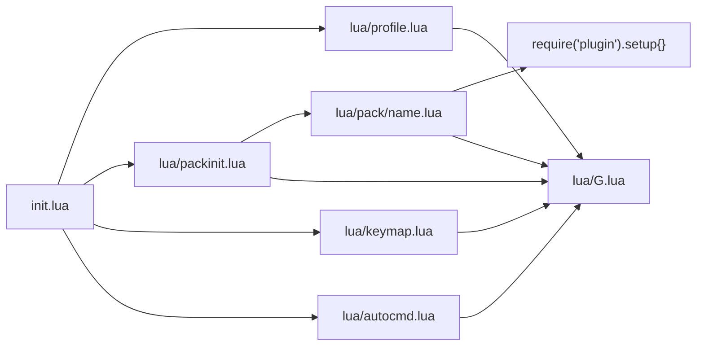

# Repository Guidelines

## Project Overview

Personal Neovim configuration (Lua), forked from `github.com/yaocccc/nvim` and locally reworked for startup performance. Not a library: the "product" is the editor session a user gets when Neovim is launched with this directory as `~/.config/nvim`.

Single-user, single-machine config. No build step, no package manager beyond lazy.nvim, no CI, no test suite.

## Architecture & Data Flow



- `init.lua` is the only entry point. Order is fixed: enable `vim.loader`, disable 19 legacy builtins via `vim.g.loaded_<name>` and all five language providers, then `require('profile')` → `require('packinit')` → `require('keymap')` → `require('autocmd')` (`init.lua:40-43`).
- `lua/packinit.lua` bootstraps lazy.nvim (clones it to `stdpath('data')/lazy/lazy.nvim` if missing) and holds the entire plugin spec. Plugin specs use lazy triggers (`event`/`cmd`/`ft`/`keys`) and route their bodies to `lua/pack/<name>.lua`.
- `lua/pack/<name>.lua` modules export `M.config()` and `M.setup()`. lazy.nvim calls `M.config()` from `init = ...` **before** plugin load (globals, vimscript commands, pre-load keymaps) and `M.setup()` from `config = ...` **after** load (`require('<plugin>').setup{...}`). Every module follows `local G = require('G')` / `local M = {}` / … / `return M`.
- `lua/G.lua` is the shared facade: aliases `vim.g|b|o|v|fn|api|opt|treesitter` and wraps `map`, `hi`, `cmd`, `exec`, `eval`. Feature code should not call `vim.*` directly.
- Per-filetype behavior lives in `lua/autocmd.lua`: `local function _<ft>()` registered in the `local map` table, dispatched by a single `FileType` autocmd guarded by a `b:loaded` flag (`lua/autocmd.lua:79-88`), so each filetype's setup runs once per buffer.

## Key Directories

| Path | Purpose |
|---|---|
| `init.lua` | Entry point; loader/provider/builtin disabling and `require` order. |
| `lua/` | All configuration Lua. `profile.lua` (options), `keymap.lua` (global maps), `autocmd.lua` (autocmds + filetype setup), `packinit.lua` (lazy.nvim spec), `G.lua` (shared helpers). |
| `lua/pack/` | One module per plugin, 14 files, flat (no subdirectories). Loaded only via `require('pack/<name>')` from `lua/packinit.lua`. |
| `colors/` | `markdown.css` (markdown-preview stylesheet) and `solarized8_high.vim` (legacy colorscheme; active scheme is `token`). |
| `snippets/` | coc-snippets files. `*.snippets` + `.snippets` use **SnipMate** syntax; `snippets/ultisnips/all.snippets` uses **UltiSnips** syntax (`endsnippet` terminated). |
| `plugin/` | Empty. Nothing auto-loads. |
| `cache/` | Runtime `undodir`/`viewdir` (gitignored, recreated as needed). |
| `backups_*/`, `docs/`, `.serena/`, `.claude/` | Snapshots and tooling artifacts — **not** Neovim runtime config. |

## Development Commands

There is no build, lint, or test command. The only real workflows:

```bash
# After editing lua/packinit.lua (adds/removes/updates a plugin)
nvim            # restart, then in-editor:  :Lazy sync

# Reinstall every plugin from scratch
rm -rf ~/.local/share/nvim/lazy
nvim --headless -c 'autocmd User LazyComplete quitall' -c 'Lazy sync'

# Syntax-check every Lua file without loading the config (verified: checked=19 bad=0)
nvim --headless -u NONE -c 'lua for _,f in ipairs(vim.fn.glob("lua/**/*.lua", false, true)) do local fn,e=loadfile(f); if not fn then print("SYNTAX "..f..": "..tostring(e)) end end' -c 'qa!'

# Interactive smoke test — plugin installs happen on first start
nvim
```

In-editor: `:Lazy` (plugin manager UI), `:Lazy sync`, `:StartupTime` (startup profiling), `:checkhealth`.

Do not add formatter/linter configs the repo does not have (`stylua.toml`, `selene.toml`, `.luarc.json`, `.editorconfig` are all absent; `editorconfig` is deliberately disabled at `lua/profile.lua:4`).

## Code Conventions & Common Patterns

**Formatting** — 4-space indent, no tabs. Single-quoted strings dominate; both quote styles are acceptable and used. Trailing `--` comments are the norm. Comments and docs are written in **Chinese**; match that when editing existing files.

**Never call `vim.*` directly in feature code.** Use the `G` facade:

```lua
local G = require('G')
G.opt.number = true                 -- options
G.g.copilot_no_tab_map = true       -- globals
G.cmd('hi! link CocPum Pmenu')      -- ex-commands / vimscript autocmds
G.hi({ MDCodeBlock = { bg = '#1c1c1c' } })   -- highlights (table form)
```

**Keymaps are declarative 4-tuples passed to `G.map`** — `{ mode, lhs, rhs, opts }`. The 4th element is **mandatory** (`G.map` indexes `map[4]["buffer"]` unguarded, `lua/G.lua:14`), even when empty:

```lua
G.map({
    -- global mapping
    { 'v', 'v', '<Plug>(expand_region_expand)', { silent = true } },
    -- buffer-local mapping: G.map strips `buffer` and uses nvim_buf_set_keymap(0, …)
    { 'v', 'D', ':call SurroundVaddPairs("/** ", " */")<cr>', { noremap = true, silent = true, buffer = true } },
})
```

- Opts used in practice: `noremap` (not `remap`), `silent`, `expr`, `buffer`, `script`.
- `buffer = true` means "current buffer at call time"; `G.map` deletes the key and installs the map with `nvim_buf_set_keymap(0, …)`. Only `lua/autocmd.lua` uses it.
- `desc` is essentially unused; the sole exception is `lua/pack/nvim-tree.lua:57-58`, which builds `{ desc = 'nvim-tree: ' .. desc, buffer = bufnr, … }`. Don't sprinkle `desc` elsewhere.
- `G.map` iterates with `pairs`, so insertion order inside one call is unspecified — never rely on ordering between overlapping mappings in the same list.
- Conditional mappings are **vimscript `expr` strings**, not Lua callbacks (e.g. `coc#pum#visible() ? '<c-y>' : '<c-f>'`).
- `vim.keymap.set` appears in exactly one place (`lua/pack/nvim-tree.lua:62-75`, buffer-local with `desc`). Prefer `G.map` for consistency.
- **No leader key is defined** anywhere (`mapleader`/`maplocalleader` are never set). Never write mappings that assume `<leader>`.

**Global functions for `v:lua`** — functions intended to be called from vimscript are declared *without* `local` and prefixed `Magic*` or `G_*` (`MagicFoldText`, `MagicMove`, `MagicSave`, `MagicToggleHump`, `G_markdown_toggleCheck`, `G_toggleBar`). They are referenced as `'v:lua.MagicSave()'` inside mapping strings and option values. This applies in `lua/pack/nvim-lines.lua` too: `GitInfo`, `CocErrCount`, `GetFt` must stay global because `g:line_statusline_getters` calls them via `v:lua` (`lua/pack/nvim-lines.lua:26`).

**The `config()` / `setup()` contract is load-bearing, including empty bodies.** When a plugin has nothing to do in one phase, write an explicit no-op — do not delete the function, since `lua/packinit.lua` calls it unconditionally:

```lua
function M.setup()
    -- do nothing
end
```

**Adding a plugin** (both steps required):

1. Create `lua/pack/<name>.lua` returning `M` with `config()` and/or `setup()`.
2. Add a spec table inside `require("lazy").setup({ ... })` in `lua/packinit.lua` with a lazy trigger (`event`, `cmd`, `ft`, `keys`, or `lazy = false` + `priority` for startup-critical work):

```lua
{
    'author/plugin',
    cmd = { 'PluginCommand' },
    init = function() require('pack/plugin').config() end,
    config = function() require('pack/plugin').setup() end,
},
```

Then restart and `:Lazy sync`. Never hand-edit `lazy-lock.json`.

**Options** are set only in `lua/profile.lua` via `G.opt.*` / `G.g.*`. `lua/pack/**` contains zero option writes — keep it that way.

**Error handling** — there is no `pcall`/`xpcall` anywhere in `lua/pack/`. Tolerance is expressed in vimscript (`try | … | catch | endtry` at `lua/pack/tree-sitter.lua:9`, `silent!` at `lua/pack/wilder.lua:40`).

**`require` discipline** — only `require('G')` sits at file top level. Plugin modules are required inside the function that needs them (`lua/pack/nvim-tree.lua:53`, `lua/pack/wilder.lua:9`). Mapping strings that require a module (`:lua require('pack/vim-floaterm').toggleFT(...)`) resolve at keypress time and must not depend on cwd.

**Autocmds** — two styles, by location: `lua/autocmd.lua` uses `G.api.nvim_create_autocmd({...}, { command = … / callback = … })`; `lua/pack/*` uses vimscript strings through `G.cmd("au …")`. `G.exec` exists but is unused.

## Important Files

| File | Role |
|---|---|
| `init.lua` | Entry point: `vim.loader`, builtin/provider disabling, module load order. |
| `lua/G.lua` | `G` facade (`map`, `hi`, `cmd`, `exec`, `eval`, `vim.*` aliases). |
| `lua/profile.lua` | All editor options, undodir/viewdir, `MagicFoldText()` used by `foldtext`. |
| `lua/packinit.lua` | lazy.nvim bootstrap + the complete plugin spec (single source of truth for plugins and their lazy triggers). |
| `lua/keymap.lua` | All global mappings plus `MagicMove`/`MagicSave`/`MagicToggleHump`. |
| `lua/autocmd.lua` | Global autocmds, per-filetype setup table, `G_markdown_*` and `G_toggleBar` helpers. |
| `lua/pack/nvim-tree.lua` | Largest plugin module; only user of `vim.keymap.set` and `desc`; extra export `M.magicCd()`. |
| `lua/pack/coc.lua` | coc.nvim globals + 22 `coc_global_extensions`; pairs with `coc-settings.json`. |
| `coc-settings.json` | coc/nvim LSP + prettier settings, 4-space indent, strict JSON, no comments. Edited directly, never by Lua. |
| `colors/markdown.css` | Stylesheet for markdown-preview.nvim. |
| `README.md` | Chinese user docs: install, structure, keybinding tables. Documents plugins that no longer exist here (see Gotchas). |

## Runtime/Tooling Preferences

- **Runtime**: Neovim (verified against 0.10.4, LuaJIT 2.1). Lua config only; no LuaRocks rockspecs or luarocks-managed dependencies.
- **Plugin manager**: lazy.nvim, self-bootstrapping from `stdpath('data')/lazy/lazy.nvim`. Plugin cache lives at `~/.local/share/nvim/lazy`; wiping it re-downloads everything.
- **`lazy-lock.json` is untracked** (absent from `git ls-files`) though present on disk and *not* gitignored. It is regenerated by lazy.nvim — never edit or commit it by hand.
- **Providers are all disabled** (`init.lua:34-38`): perl, ruby, node, python2, python3. Do not write config that requires `vim.python3` or provider-based plugins. `g:python3_host_prog` is set from the `PYTHON` env var (`lua/profile.lua:3`) but the provider is off.
- **External binaries** required by behavior, none auto-installed: `rg`, `fd`, `bat` (fzf-lua grep/files), `node` (JS runner via `<F5>`), `yarn` (markdown-preview app build), `js-beautify` (`npm i js-beautify -g`), `git` (lazy.nvim).
- **Colorscheme is set by a plugin, not a config file**: `token` (`lazy = false`, `priority = 1000`), not from `profile.lua`. `colors/solarized8_high.vim` is legacy and unreferenced by tracked config.
- **Ignore `*:Zone.Identifier*` files** — 366 WSL alternate-data-stream stubs scattered through every directory (sometimes doubled). Never edit, mirror, or cite them. Same for `backups_*` trees.

## Testing & QA

There is no test framework, no CI, and no unit tests. Verification is manual:

1. **Syntax gate** — run the `nvim --headless -u NONE -c 'lua … loadfile …'` snippet above. It compiles every `lua/**/*.lua` file without loading the config and prints per-file errors.
2. **Load the config** — launch `nvim`; watch for `E5108`/lazy.nvim errors on startup. Loading the config is the only way to catch runtime errors in `init=`/`config=` callbacks.
3. **Exercise the changed surface** — a keymap change is verified by pressing the key in a real session in the relevant mode; an autocmd change by opening a file of that `filetype`; a plugin change via `:Lazy`, then the plugin's own command.
4. `:StartupTime` for regressions in startup cost; `:checkhealth` for environment problems.

When changing a spec in `lua/packinit.lua`, the acceptance check is: restart, `:Lazy sync` completes without errors, and the plugin's trigger (`event`/`cmd`/`ft`/`keys`) actually fires.

## Gotchas

- **Root-level `packinit.lua`, `profile.lua`, `optimized_packinit.lua`, `optimized_profile.lua` are dead files.** Neovim resolves `require('profile')` to `lua/profile.lua`. `apply_optimization.sh` and `OPTIMIZATION_GUIDE.md` write to those root copies, so they accomplish nothing. Edit `lua/**` only.
- `lua/pack/markdown.lua:7` hardcodes `/home/chenyc/.config/nvim/colors/markdown.css` — a stale foreign path.
- `lua/pack/markdown.lua:17` (`M.setup_hlcodeblock`) is dead: never called, and its `hl-mdcodeblock` dependency is not installed or declared.
- `lua/pack/yaocccc.lua` holds config for **two** plugins (`yaocccc/vim-echo` and `yaocccc/vim-comment`) reached from a single `packinit.lua` spec entry. `lua/pack/markdown.lua` is likewise shared by `vim-markdown-toc` (init only) and `markdown-preview.nvim` (config).
- `ibhagwan/fzf-lua` and `mzlogin/vim-markdown-toc` declare only `init=`, so their `M.setup()` never runs. `yaocccc/vim-echo`, `vim-fcitx2en`, `vim-surround` declare neither hook.
- `lua/pack/vim-visual-multi.lua` and `lua/pack/vim-dadbod.lua` are tracked in git but **deleted from the working tree**, along with their `packinit.lua` entries. `README.md` still documents their keybindings (also `dstein64/vim-startuptime`). Treat README as upstream drift, not as a spec.
- `G.map` and `G.hi` mutate the tables passed to them (`lua/G.lua:15` deletes `buffer`; `lua/G.lua:25` aliases the highlight table). Never reuse a map-opts or highlight table object across calls.
